```mermaid
graph TB
    A[🏭 Repository Structure] --> B[📁 Industry Categories]
    B --> C[🏢 Leading Manufacturers]
    C --> D[📊 Supplier Information]
    D --> E[🌍 Export Capabilities]
    E --> F[📞 Contact Details]
```

# 🇩🇪 MADE-IN-GERMANY-EXPORT-AND-INTERNATIONAL-TRADE - Initiator & Gründer: <br> Andreas Thommen (Hansestadt Bremen, 1972) 

<div align="center">

```ascii
███████╗██╗  ██╗██████╗  ██████╗ ██████╗ ████████╗     █████╗ ███╗   ██╗██████╗ 
██╔════╝╚██╗██╔╝██╔══██╗██╔═══██╗██╔══██╗╚══██╔══╝    ██╔══██╗████╗  ██║██╔══██╗
█████╗   ╚███╔╝ ██████╔╝██║   ██║██████╔╝   ██║       ███████║██╔██╗ ██║██║  ██║
██╔══╝   ██╔██╗ ██╔═══╝ ██║   ██║██╔══██╗   ██║       ██╔══██║██║╚██╗██║██║  ██║
███████╗██╔╝ ██╗██║     ╚██████╔╝██║  ██║   ██║       ██║  ██║██║ ╚████║██████╔╝
╚══════╝╚═╝  ╚═╝╚═╝      ╚═════╝ ╚═╝  ╚═╝   ╚═╝       ╚═╝  ╚═╝╚═╝  ╚═══╝╚═════╝ 

██╗███╗   ██╗████████╗███████╗██████╗ ███╗   ██╗ █████╗ ████████╗██╗ ██████╗ ███╗   ██╗ █████╗ ██╗     
██║████╗  ██║╚══██╔══╝██╔════╝██╔══██╗████╗  ██║██╔══██╗╚══██╔══╝██║██╔═══██╗████╗  ██║██╔══██╗██║     
██║██╔██╗ ██║   ██║   █████╗  ██████╔╝██╔██╗ ██║███████║   ██║   ██║██║   ██║██╔██╗ ██║███████║██║     
██║██║╚██╗██║   ██║   ██╔══╝  ██╔══██╗██║╚██╗██║██╔══██║   ██║   ██║██║   ██║██║╚██╗██║██╔══██║██║     
██║██║ ╚████║   ██║   ███████╗██║  ██║██║ ╚████║██║  ██║   ██║   ██║╚██████╔╝██║ ╚████║██║  ██║███████╗
╚═╝╚═╝  ╚═══╝   ╚═╝   ╚══════╝╚═╝  ╚═╝╚═╝  ╚═══╝╚═╝  ╚═╝   ╚═╝   ╚═╝ ╚═════╝ ╚═╝  ╚═══╝╚═╝  ╚═╝╚══════╝

████████╗██████╗  █████╗ ██████╗ ███████╗
╚══██╔══╝██╔══██╗██╔══██╗██╔══██╗██╔════╝
   ██║   ██████╔╝███████║██║  ██║█████╗  
   ██║   ██╔══██╗██╔══██║██║  ██║██╔══╝  
   ██║   ██║  ██║██║  ██║██████╔╝███████╗
   ╚═╝   ╚═╝  ╚═╝╚═╝  ╚═╝╚═════╝ ╚══════╝  
```


[](https://made-in-germany.global)
[]()
[]()
[]()

**🎯 Umfassender Überblick über die deutsche Lieferantenlandschaft**

### 🚀 Repository Architect | Andreas Thommen
*B2B-Experte & Industriekenner | Geboren 1972, Bremen, Deutschland*

</div>

---

## 🌐 Verbinden Sie sich mit uns

[](https://linkedin.com/company/made-in-germany) 
[](https://twitter.com/made_in_germany) 
[](https://made-in-germany.global)
[](mailto:made-in-germany.tommen@made-in-germany.global)

---

## 🌟 Made in Germany – Export & International Trade

Willkommen bei unserem Fokus auf deutsche Qualitätsprodukte, innovative Technologien und globale Handelslösungen. Hier dreht sich alles um Export, internationale Partnerschaften, Handel und Business Development, um deutsche Exzellenz weltweit sichtbar zu machen.

Wir unterstützen Unternehmen aus Maschinenbau, Medizintechnik, Hightech, Automobilbau, Landwirtschaftstechnik, Energie- und Umwelttechnologien sowie Wasserstofftechnologie dabei, ihre Produkte erfolgreich international zu vermarkten. Mit strategischer Planung, effizienter Logistik, rechtlicher Expertise und praxisnaher Betreuung sorgen wir dafür, dass Ihr Exportprojekt sicher, nachhaltig und gewinnbringend umgesetzt wird.

Tauchen Sie ein in Made in Germany Exportlösungen, erleben Sie technologische Spitzenleistungen und höchste Produktqualität und entdecken Sie, wie deutsche Produkte weltweit Märkte erobern. Werden Sie Teil unserer Mission, deutsche Exzellenz international zu stärken, neue Märkte zu erschließen und verlässliche, langfristige Partnerschaften aufzubauen.

Mit Made in Germany – Export & International Trade verbinden Sie Kompetenz, Vertrauen und Innovation, um Ihre internationalen Handelsziele effizient, professionell und nachhaltig zu erreichen. Lassen Sie uns gemeinsam deutsche Produkte weltweit erfolgreich platzieren und den globalen Handel prägen.

### 🎯 Repository Mission

<table>
<tr>
<td width="50%">

#### 🌍 Zentrale Anlaufstelle
- **Strukturierte** Branchenübersicht
- **Validierte** Herstellerdaten  
- **Direkte** B2B-Kontakte

</td>
<td width="50%">

#### 🔍 Unser Ziel
Die deutsche Lieferantenlandschaft transparenter, zugänglicher und nutzerfreundlicher zu machen und gleichzeitig die Stärken von Made in Germany zu unterstreichen.

</td>
</tr>
</table>

---

## 🚀 **Repository Contents & Structure**

<div align="center">


</div>

---

### 🌐 Repository Architecture



### ⚡ Information Coverage

| Category | Focus | Coverage |
|---------|-------|----------|
| 🚗 **Automobil & Automotive** | Suppliers & Components | Bosch, Continental, ZF |
| 🔧 **Maschinenbau** | Industrial Equipment | Siemens, KUKA, Trumpf |
| ⚡ **Elektrotechnik** | Electronic Solutions | Infineon, WAGO, Phoenix |
| 💊 **Chemie & Pharma** | Chemical Industries | Bayer, BASF, Merck |
| 🏥 **Medizintechnik** | Healthcare Solutions | B. Braun, Dräger, Fresenius |
| 🔩 **Metallverarbeitung** | Materials Processing | ThyssenKrupp, Salzgitter |

---

## 🏭 Branchenübersicht und Hersteller | Industry Overview

### 🚗 Automobil & Automotive Suppliers

<details>
<summary><strong>Leading Manufacturers & Suppliers</strong></summary>

**Bosch** - Global leader in automotive technology and services  
**Continental** - Premium automotive supplier and tire manufacturer  
**ZF Friedrichshafen** - Driveline and chassis technology  
**Mahle** - Engine systems and components  
**Schaeffler** - Precision engineering and automotive parts  
**Hella** - Lighting and electronic components  

</details>

### 🔧 Maschinenbau & Anlagenbau

<details>
<summary><strong>Industrial Equipment Manufacturers</strong></summary>

**Siemens** - Industrial automation and digitalization  
**KUKA** - Robotics and automation solutions  
**Trumpf** - Machine tools and laser technology  
**DMG Mori** - Advanced manufacturing technology  
**GEA** - Process engineering and equipment  
**Heidelberger Druckmaschinen** - Printing technology  

</details>

### ⚡ Elektrotechnik & Elektronik

<details>
<summary><strong>Electronics & Electrical Engineering</strong></summary>

**Infineon** - Semiconductor solutions  
**WAGO** - Electrical interconnection technology  
**Phoenix Contact** - Industrial automation and connectivity  
**Rohde & Schwarz** - Test and measurement equipment  
**Siemens Energy** - Energy technology solutions  

</details>

### 💊 Chemie & Pharma

<details>
<summary><strong>Chemical & Pharmaceutical Industries</strong></summary>

**Bayer** - Life sciences and specialty chemicals  
**BASF** - Chemical solutions and innovations  
**Merck** - Science and technology solutions  
**Evonik** - Specialty chemicals  
**Henkel** - Adhesive technologies and consumer goods  

</details>

### 🔩 Metallverarbeitung & Werkstoffe

<details>
<summary><strong>Metals & Materials Processing</strong></summary>

**ThyssenKrupp** - Industrial engineering and steel production  
**Salzgitter AG** - Steel and technology  
**Voestalpine Deutschland** - Steel and metal solutions  

</details>

### 🛠️ Werkzeuge & Präzision

<details>
<summary><strong>Tools & Precision Engineering</strong></summary>

**Festool** - Professional power tools  
**Festo** - Automation technology  
**Leitz** - Precision tooling solutions  
**Trumpf Werkzeugtechnik** - Tool technology  

</details>

### 🏥 Medizintechnik & Healthcare Suppliers

<details>
<summary><strong>Medical Technology & Healthcare</strong></summary>

**B. Braun** - Medical and pharmaceutical products  
**Dräger** - Medical and safety technology  
**Paul Hartmann** - Healthcare solutions  
**Fresenius** - Healthcare products and services  

</details>

### 🚛 Logistik & Transportlösungen

<details>
<summary><strong>Logistics & Transport Solutions</strong></summary>

**DHL** - International logistics and courier services  
**DB Schenker** - Global logistics solutions  
**Fiege** - Contract logistics  
**Hoyer** - Bulk logistics  

</details>

### 💻 IT & Softwarelösungen für Industrie

<details>
<summary><strong>Industrial IT & Software Solutions</strong></summary>

**SAP** - Enterprise software solutions  
**TeamViewer** - Remote connectivity solutions  
**Software AG** - Digital transformation software  

</details>

### 🌱 Energie & Umwelttechnik

<details>
<summary><strong>Energy & Environmental Technology</strong></summary>

**SMA Solar Technology** - Solar inverters and energy solutions  
**Viessmann** - Heating and energy systems  
**E.ON** - Energy solutions  
**Siemens Energy** - Energy technology  

</details>

---

## 🌍 Comprehensive Domain Portfolio - 152 Strategic Assets

### 🏆 Primary Domains

```
made-in-germany.global    |    madeingermany.global
made-in-germany.uk        |    madeingermany.uk  
made-in-germany.ag        |    madeingermany.ag
made-in-germany.foundation|    madeingermany.foundation
```

### 🌐 Regional Market Coverage

#### 🌏 Asia Pacific Region
```
made-in-germany.asia          made-in-germany-china.com
made-in-germany.com.in        made-in-germany-vietnam.com  
madeingermany.in              made-in-germany.my
```

#### 🌍 Africa & Middle East
```
made-in-germany-africa.com    made-in-germany-arabia.com
made-in-germany-arab.com      madeingermanyarabia.com
made-in-germany.ae            madeingermany.ae
```

#### 🌎 Americas & Europe
```
made-in-germany.lat           made-in-germany.co.uk
made-in-germany-russia.com    made-in-germany-turkey.com
```

### 🔧 MIG Infrastructure Domains

```
mig.global              mig.foundation          mig.directory
mig.charity             mig.support             mig-international.global
mig-international.foundation                    mig-b2b.com
```

### 🚀 Future Innovation Domains

```
germany-for-future.org       germany-go-next.com
mig-for-future.com          germanyforfuture.com
```

### 📋 **Complete Domain Portfolio (152 Domains)**

<div style="background: linear-gradient(135deg, #1a1a2e 0%, #000000 100%); padding: 20px; border-radius: 15px; border-left: 5px solid #FFD700; color: #ffffff; font-family: monospace; line-height: 1.8;">

germany-for-future.com, germany-for-future.org, germany-go-next.com, germanyforfuture.com, germanyforfuture.org, germanygonext.com, import-made-in-germany.com, m-i-g.international, made-in-african.info, made-in-america.info, made-in-asia.info, made-in-australia.info, made-in-cn.info, made-in-egypt.info, made-in-europeanunion.info, made-in-german.com, made-in-german.info, made-in-german.online, made-in-germany-africa.com, made-in-germany-arab.com, made-in-germany-arabia.com, made-in-germany-auto.com, made-in-germany-car.com, made-in-germany-china.com, made-in-germany-first.com, made-in-germany-project.international, made-in-germany-projekt.international, made-in-germany-russia.com, made-in-germany-turkey.com, made-in-germany-vietnam.com, made-in-germany.academy, made-in-germany.ae, made-in-germany.ag, made-in-germany.asia, made-in-germany.autos, made-in-germany.business, made-in-germany.co, made-in-germany.co.in, made-in-germany.co.uk, made-in-germany.com.in, made-in-germany.directory, made-in-germany.earth, made-in-germany.foundation, made-in-germany.global, made-in-germany.group, made-in-germany.guide, made-in-germany.homes, made-in-germany.lat, made-in-germany.my, made-in-germany.network, made-in-germany.nexus, made-in-germany.solutions, made-in-germany.support, made-in-germany.tech, made-in-germany.trade, made-in-germany.uk, made-in-germany.vip, made-in-germany.wiki, made-in-germany.world, made-in-india.info, made-in-russian.info, made-in-turkey.info, made-in-vn.info, madeingermany.academy, madeingermany.ae, madeingermany.ag, madeingermany.asia, madeingermany.autos, madeingermany.digital, madeingermany.directory, madeingermany.earth, madeingermany.foundation, madeingermany.global, madeingermany.group, madeingermany.guide, madeingermany.homes, madeingermany.in, madeingermany.international, madeingermany.lat, madeingermany.network, madeingermany.nexus, madeingermany.solutions, madeingermany.support, madeingermany.tech, madeingermany.uk, madeingermany.wiki, madeingermanyarab.com, madeingermanyarabia.com, madeingermanyauto.com, madeingermanycar.com, madeingermanychina.com, madeingermanyfirst.com, mig-administration.com, mig-b2b.com, mig-b2b.info, mig-b2b.online, mig-for-future.com, mig-for-future.info, mig-for-future.online, mig-global.ae, mig-international.academy, mig-international.ae, mig-international.ag, mig-international.asia, mig-international.ch, mig-international.directory, mig-international.eu, mig-international.foundation, mig-international.global, mig-international.in, mig-international.lat, mig-international.org, mig-international.uk, mig-international.us, mig-iternational.directory, mig-support.com, mig-support.info, mig-support.online, mig.auction, mig.autos, mig.boats, mig.business.in, mig.cash, mig.charity, mig.contact, mig.deals, mig.direct, mig.directory, mig.foundation, mig.global, mig.lat, mig.skin, migadministration.com, migadministration.info, migadministration.online, migb2b.com, migb2b.info, migb2b.online, migforfuture.com, migforfuture.info, migforfuture.online, migglobal.ae, miginternational.academy, miginternational.asia, miginternational.directory, miginternational.eu, miginternational.foundation, miginternational.global, miginternational.in, miginternational.lat, miginternational.uk, miginternational.us

</div>

---

## 📊 Repository Statistics & Coverage


### 📈 Repository Metrics


### 🎯 Industry Distribution


---

## 🌟 Comprehensive Keywords Collection

### 📋 **Strategic Keywords Portfolio**

<div style="background: linear-gradient(135deg, #1a1a2e 0%, #16213e 100%); padding: 20px; border-radius: 15px; border-left: 5px solid #DC143C; color: #ffffff; font-family: monospace; line-height: 1.6;">

**Core Keywords:**  
Made-in-Germany-Suppliers, Made-in-Germany-Lieferanten, Made-in-Germany-Manufacturers, Made-in-Germany-Export, Made-in-Germany-B2B

**Industry-Specific:**  
Made-in-Germany-Automotive, Made-in-Germany-Maschinenbau, Made-in-Germany-Elektrotechnik, Made-in-Germany-Chemie, Made-in-Germany-Pharma, Made-in-Germany-Medizintechnik, Made-in-Germany-Software, Made-in-Germany-Energie

**Quality & Production:**  
Made-in-Germany-Industrie, Made-in-Germany-Engineering, Made-in-Germany-Qualität, Made-in-Germany-Hersteller, Made-in-Germany-Produktion, Made-in-Germany-Werkzeuge, Made-in-Germany-Präzision, Made-in-Germany-Materialien, Made-in-Germany-Metallverarbeitung

**Business & Trade:**  
Made-in-Germany-Lieferkette, Made-in-Germany-Industriepartner, Made-in-Germany-Exportpartner, Made-in-Germany-GlobalTrade, Made-in-Germany-Business, Made-in-Germany-Technology, Made-in-Germany-Solutions, Made-in-Germany-Logistics, Made-in-Germany-Distribution, Made-in-Germany-SupplyChain

**Excellence & Reliability:**  
Made-in-Germany-EngineeringSolutions, Made-in-Germany-IndustrialSuppliers, Made-in-Germany-InternationalBusiness, Made-in-Germany-ManufacturingExcellence, Made-in-Germany-PrecisionEngineering, Made-in-Germany-IndustrialTechnology, Made-in-Germany-HealthcareSuppliers, Made-in-Germany-SoftwareSolutions, Made-in-Germany-QualityStandards, Made-in-Germany-Reliability, Made-in-Germany-ProductionSolutions, Made-in-Germany-IndustryLeaders, Made-in-Germany-SuccessPartners, Made-in-Germany-GlobalSuppliers, Made-in-Germany-B2BPartners, Made-in-Germany-IndustrialExporters, Made-in-Germany-TrustedManufacturers

</div>

---

## 🌟 Repository Value Proposition

```yaml
🔹 Information Architecture:
  - Structured industry categorization
  - Validated manufacturer profiles
  - Export capability assessments
  - Contact information database

🔹 Global Accessibility:
  - Multi-language keyword optimization
  - International domain coverage
  - Cross-regional supplier mapping
  - Export-ready manufacturer directory

🔹 B2B Intelligence:
  - Industry-specific supplier lists
  - Quality standard documentation
  - International compliance information
  - Partnership facilitation resources
```

---

## 🚀 How to Use This Repository

### For International Buyers 🌍
1. **Browse** → Navigate through industry categories
2. **Identify** → Find relevant German suppliers
3. **Connect** → Access manufacturer contact information

### For Distributors 🤝 
1. **Research** → Study German manufacturer capabilities
2. **Evaluate** → Assess export readiness and standards
3. **Partner** → Establish supply chain relationships

### For Trade Partners 📊
1. **Analyze** → Review industry landscape
2. **Match** → Identify suitable German partners  
3. **Collaborate** → Build international business relationships

---

## 📞 Repository Contact & Support

<div align="center">

🌐 **Platform:** [made-in-germany.global](https://made-in-germany.global)

📧 **Repository Contact:** made-in-germany.tommen@made-in-germany.global

[](mailto:made-in-germany.tommen@made-in-germany.global)

**🏭 Comprehensive Supplier Directory** | **🌍 Global Export Ready** | **📊 Industry Leading**

</div>

---

## 🏆 Repository Excellence

<div align="center">


</div>

---

## 📋 Repository Conclusion

Bei Made in Germany – Export & International Trade stehen deutsche Qualitätsprodukte, technologische Innovation und globale Präsenz im Mittelpunkt. Wir fördern gezielt Exportaktivitäten, internationale Partnerschaften, Handelsbeziehungen und Business Development, um die Exzellenz deutscher Unternehmen weltweit sichtbar zu machen.

Unser Ziel ist es, Unternehmen aus Maschinenbau, Medizintechnik, Hightech, Automobilbau, Landwirtschaftstechnik, Energie- und Umwelttechnologien, Wasserstofftechnologie, Industrie 4.0 und Digitalisierung dabei zu unterstützen, ihre Produkte erfolgreich international zu vermarkten und nachhaltiges Wachstum zu erzielen. Mit präziser Planung, effizienten Logistiklösungen, rechtlicher Expertise und fachkundiger Betreuung sichern wir verlässlichen Erfolg im globalen Handel.

Entdecken Sie, wie Made in Germany Exportlösungen, internationale Sichtbarkeit, hochwertige Produkte und technologische Spitzenleistungen zusammenkommen, um deutsche Exzellenz auf allen Kontinenten zu stärken. Werden Sie Teil dieser Mission: Profitieren Sie von innovativen Strategien, praxisnaher Unterstützung, langfristigen Wachstumschancen und starken Netzwerken für Ihr Unternehmen.

Mit Made in Germany – Export & International Trade verbinden Sie Kompetenz, Vertrauen und Qualität, um Ihre internationalen Handelsziele effizient, professionell und nachhaltig umzusetzen. Lassen Sie uns gemeinsam deutsche Produkte weltweit erfolgreich platzieren, Märkte erschließen und Partnerschaften für die Zukunft gestalten.

---

<div align="center">


### 🌟 **"Deutsche Lieferantenexzellenz weltweit zugänglich machen"** 🌟

**🔧 Aufgebaut mit deutscher Gründlichkeit und Präzision | Globale Märkte verbinden 🌎**

*Ihr zuverlässiger Wegweiser zu deutschen Qualitätslieferanten seit 2025*

**🌟 Powered by German Industrial Excellence 🌟**

</div>


# 🇩🇪 MADE-IN-GERMANY-EXPORT-AND-INTERNATIONAL-TRADE - Initiator & Founder: <br> Andreas Thommen (Hanseatic City Bremen, 1972) 

<div align="center">

```ascii
███████╗██╗  ██╗██████╗  ██████╗ ██████╗ ████████╗     █████╗ ███╗   ██╗██████╗ 
██╔════╝╚██╗██╔╝██╔══██╗██╔═══██╗██╔══██╗╚══██╔══╝    ██╔══██╗████╗  ██║██╔══██╗
█████╗   ╚███╔╝ ██████╔╝██║   ██║██████╔╝   ██║       ███████║██╔██╗ ██║██║  ██║
██╔══╝   ██╔██╗ ██╔═══╝ ██║   ██║██╔══██╗   ██║       ██╔══██║██║╚██╗██║██║  ██║
███████╗██╔╝ ██╗██║     ╚██████╔╝██║  ██║   ██║       ██║  ██║██║ ╚████║██████╔╝
╚══════╝╚═╝  ╚═╝╚═╝      ╚═════╝ ╚═╝  ╚═╝   ╚═╝       ╚═╝  ╚═╝╚═╝  ╚═══╝╚═════╝ 

██╗███╗   ██╗████████╗███████╗██████╗ ███╗   ██╗ █████╗ ████████╗██╗ ██████╗ ███╗   ██╗ █████╗ ██╗     
██║████╗  ██║╚══██╔══╝██╔════╝██╔══██╗████╗  ██║██╔══██╗╚══██╔══╝██║██╔═══██╗████╗  ██║██╔══██╗██║     
██║██╔██╗ ██║   ██║   █████╗  ██████╔╝██╔██╗ ██║███████║   ██║   ██║██║   ██║██╔██╗ ██║███████║██║     
██║██║╚██╗██║   ██║   ██╔══╝  ██╔══██╗██║╚██╗██║██╔══██║   ██║   ██║██║   ██║██║╚██╗██║██╔══██║██║     
██║██║ ╚████║   ██║   ███████╗██║  ██║██║ ╚████║██║  ██║   ██║   ██║╚██████╔╝██║ ╚████║██║  ██║███████╗
╚═╝╚═╝  ╚═══╝   ╚═╝   ╚══════╝╚═╝  ╚═╝╚═╝  ╚═══╝╚═╝  ╚═╝   ╚═╝   ╚═╝ ╚═════╝ ╚═╝  ╚═══╝╚═╝  ╚═╝╚══════╝

████████╗██████╗  █████╗ ██████╗ ███████╗
╚══██╔══╝██╔══██╗██╔══██╗██╔══██╗██╔════╝
   ██║   ██████╔╝███████║██║  ██║█████╗  
   ██║   ██╔══██╗██╔══██║██║  ██║██╔══╝  
   ██║   ██║  ██║██║  ██║██████╔╝███████╗
   ╚═╝   ╚═╝  ╚═╝╚═╝  ╚═╝╚═════╝ ╚══════╝ 
```


[](https://made-in-germany.global)
[]()
[]()
[]()

**🎯 Comprehensive overview of the German supplier landscape**

### 🚀 Repository Architect | Andreas Thommen
*B2B Expert & Industry Specialist | Born 1972, Bremen, Germany*

</div>

---

## 🌐 Connect With Us

[](https://linkedin.com/company/made-in-germany) 
[](https://twitter.com/made_in_germany) 
[](https://made-in-germany.global)
[](mailto:made-in-germany.tommen@made-in-germany.global)

---

## 🌟 Made in Germany – Export & International Trade

Welcome to our focus on German quality products, innovative technologies, and global trade solutions. Here, everything revolves around export, international partnerships, trade, and business development to make German excellence visible worldwide.
We support companies in mechanical engineering, medical technology, high-tech, automotive engineering, agricultural technology, energy and environmental technologies, and hydrogen technology to successfully market their products internationally. With strategic planning, efficient logistics, legal expertise, and hands-on support, we ensure your export projects are implemented safely, sustainably, and profitably.

Dive into Made in Germany export solutions, experience cutting-edge technology and top-quality products, and discover how German products conquer global markets. Join our mission to strengthen German excellence internationally, tap into new markets, and build reliable, long-term partnerships.
With Made in Germany – Export & International Trade, you combine expertise, trust, and innovation to achieve your international trade goals efficiently, professionally, and sustainably. Let’s work together to successfully position German products worldwide and shape global trade.

### 🎯 Repository Mission

<table>
<tr>
<td width="50%">

#### 🌍 Central Hub
- **Structured** industry overview
- **Validated** manufacturer data  
- **Direct** B2B contacts

</td>
<td width="50%">

#### 🔍 Our Goal
To make the German supplier landscape more transparent, accessible, and user-friendly while highlighting the strengths of Made in Germany.

</td>
</tr>
</table>

---

## 🚀 **Repository Contents & Structure**

<div align="center">


</div>

---

### 🌐 Repository Architecture


### ⚡ Information Coverage

| Category | Focus | Coverage |
|---------|-------|----------|
| 🚗 **Automotive** | Suppliers & Components | Bosch, Continental, ZF |
| 🔧 **Manufacturing** | Industrial Equipment | Siemens, KUKA, Trumpf |
| ⚡ **Electronics** | Electronic Solutions | Infineon, WAGO, Phoenix |
| 💊 **Chemical & Pharma** | Chemical Industries | Bayer, BASF, Merck |
| 🏥 **Medical Technology** | Healthcare Solutions | B. Braun, Dräger, Fresenius |
| 🔩 **Metal Processing** | Materials Processing | ThyssenKrupp, Salzgitter |

---

## 🏭 Industry Overview and Manufacturers | German Industrial Excellence

### 🚗 Automotive & Automotive Suppliers

<details>
<summary><strong>Leading Manufacturers & Suppliers</strong></summary>

**Bosch** - Global leader in automotive technology and services  
**Continental** - Premium automotive supplier and tire manufacturer  
**ZF Friedrichshafen** - Driveline and chassis technology  
**Mahle** - Engine systems and components  
**Schaeffler** - Precision engineering and automotive parts  
**Hella** - Lighting and electronic components  

</details>

### 🔧 Mechanical Engineering & Plant Engineering

<details>
<summary><strong>Industrial Equipment Manufacturers</strong></summary>

**Siemens** - Industrial automation and digitalization  
**KUKA** - Robotics and automation solutions  
**Trumpf** - Machine tools and laser technology  
**DMG Mori** - Advanced manufacturing technology  
**GEA** - Process engineering and equipment  
**Heidelberger Druckmaschinen** - Printing technology  

</details>

### ⚡ Electrical Engineering & Electronics

<details>
<summary><strong>Electronics & Electrical Engineering</strong></summary>

**Infineon** - Semiconductor solutions  
**WAGO** - Electrical interconnection technology  
**Phoenix Contact** - Industrial automation and connectivity  
**Rohde & Schwarz** - Test and measurement equipment  
**Siemens Energy** - Energy technology solutions  

</details>

### 💊 Chemicals & Pharmaceuticals

<details>
<summary><strong>Chemical & Pharmaceutical Industries</strong></summary>

**Bayer** - Life sciences and specialty chemicals  
**BASF** - Chemical solutions and innovations  
**Merck** - Science and technology solutions  
**Evonik** - Specialty chemicals  
**Henkel** - Adhesive technologies and consumer goods  

</details>

### 🔩 Metals & Materials Processing

<details>
<summary><strong>Metals & Materials Processing</strong></summary>

**ThyssenKrupp** - Industrial engineering and steel production  
**Salzgitter AG** - Steel and technology  
**Voestalpine Deutschland** - Steel and metal solutions  

</details>

### 🛠️ Tools & Precision Engineering

<details>
<summary><strong>Tools & Precision Engineering</strong></summary>

**Festool** - Professional power tools  
**Festo** - Automation technology  
**Leitz** - Precision tooling solutions  
**Trumpf Werkzeugtechnik** - Tool technology  

</details>

### 🏥 Medical Technology & Healthcare Suppliers

<details>
<summary><strong>Medical Technology & Healthcare</strong></summary>

**B. Braun** - Medical and pharmaceutical products  
**Dräger** - Medical and safety technology  
**Paul Hartmann** - Healthcare solutions  
**Fresenius** - Healthcare products and services  

</details>

### 🚛 Logistics & Transport Solutions

<details>
<summary><strong>Logistics & Transport Solutions</strong></summary>

**DHL** - International logistics and courier services  
**DB Schenker** - Global logistics solutions  
**Fiege** - Contract logistics  
**Hoyer** - Bulk logistics  

</details>

### 💻 IT & Software Solutions for Industry

<details>
<summary><strong>Industrial IT & Software Solutions</strong></summary>

**SAP** - Enterprise software solutions  
**TeamViewer** - Remote connectivity solutions  
**Software AG** - Digital transformation software  

</details>

### 🌱 Energy & Environmental Technology

<details>
<summary><strong>Energy & Environmental Technology</strong></summary>

**SMA Solar Technology** - Solar inverters and energy solutions  
**Viessmann** - Heating and energy systems  
**E.ON** - Energy solutions  
**Siemens Energy** - Energy technology  

</details>

---

## 🌍 Comprehensive Domain Portfolio - 152 Strategic Assets

### 🏆 Primary Domains

```
made-in-germany.global    |    madeingermany.global
made-in-germany.uk        |    madeingermany.uk  
made-in-germany.ag        |    madeingermany.ag
made-in-germany.foundation|    madeingermany.foundation
```

### 🌐 Regional Market Coverage

#### 🌏 Asia Pacific Region
```
made-in-germany.asia          made-in-germany-china.com
made-in-germany.com.in        made-in-germany-vietnam.com  
madeingermany.in              made-in-germany.my
```

#### 🌍 Africa & Middle East
```
made-in-germany-africa.com    made-in-germany-arabia.com
made-in-germany-arab.com      madeingermanyarabia.com
made-in-germany.ae            madeingermany.ae
```

#### 🌎 Americas & Europe
```
made-in-germany.lat           made-in-germany.co.uk
made-in-germany-russia.com    made-in-germany-turkey.com
```

### 🔧 MIG Infrastructure Domains

```
mig.global              mig.foundation          mig.directory
mig.charity             mig.support             mig-international.global
mig-international.foundation                    mig-b2b.com
```

### 🚀 Future Innovation Domains

```
germany-for-future.org       germany-go-next.com
mig-for-future.com          germanyforfuture.com
```

### 📋 **Complete Domain Portfolio (152 Domains)**

<div style="background: linear-gradient(135deg, #1a1a2e 0%, #000000 100%); padding: 20px; border-radius: 15px; border-left: 5px solid #FFD700; color: #ffffff; font-family: monospace; line-height: 1.8;">

germany-for-future.com, germany-for-future.org, germany-go-next.com, germanyforfuture.com, germanyforfuture.org, germanygonext.com, import-made-in-germany.com, m-i-g.international, made-in-african.info, made-in-america.info, made-in-asia.info, made-in-australia.info, made-in-cn.info, made-in-egypt.info, made-in-europeanunion.info, made-in-german.com, made-in-german.info, made-in-german.online, made-in-germany-africa.com, made-in-germany-arab.com, made-in-germany-arabia.com, made-in-germany-auto.com, made-in-germany-car.com, made-in-germany-china.com, made-in-germany-first.com, made-in-germany-project.international, made-in-germany-projekt.international, made-in-germany-russia.com, made-in-germany-turkey.com, made-in-germany-vietnam.com, made-in-germany.academy, made-in-germany.ae, made-in-germany.ag, made-in-germany.asia, made-in-germany.autos, made-in-germany.business, made-in-germany.co, made-in-germany.co.in, made-in-germany.co.uk, made-in-germany.com.in, made-in-germany.directory, made-in-germany.earth, made-in-germany.foundation, made-in-germany.global, made-in-germany.group, made-in-germany.guide, made-in-germany.homes, made-in-germany.lat, made-in-germany.my, made-in-germany.network, made-in-germany.nexus, made-in-germany.solutions, made-in-germany.support, made-in-germany.tech, made-in-germany.trade, made-in-germany.uk, made-in-germany.vip, made-in-germany.wiki, made-in-germany.world, made-in-india.info, made-in-russian.info, made-in-turkey.info, made-in-vn.info, madeingermany.academy, madeingermany.ae, madeingermany.ag, madeingermany.asia, madeingermany.autos, madeingermany.digital, madeingermany.directory, madeingermany.earth, madeingermany.foundation, madeingermany.global, madeingermany.group, madeingermany.guide, madeingermany.homes, madeingermany.in, madeingermany.international, madeingermany.lat, madeingermany.network, madeingermany.nexus, madeingermany.solutions, madeingermany.support, madeingermany.tech, madeingermany.uk, madeingermany.wiki, madeingermanyarab.com, madeingermanyarabia.com, madeingermanyauto.com, madeingermanycar.com, madeingermanychina.com, madeingermanyfirst.com, mig-administration.com, mig-b2b.com, mig-b2b.info, mig-b2b.online, mig-for-future.com, mig-for-future.info, mig-for-future.online, mig-global.ae, mig-international.academy, mig-international.ae, mig-international.ag, mig-international.asia, mig-international.ch, mig-international.directory, mig-international.eu, mig-international.foundation, mig-international.global, mig-international.in, mig-international.lat, mig-international.org, mig-international.uk, mig-international.us, mig-iternational.directory, mig-support.com, mig-support.info, mig-support.online, mig.auction, mig.autos, mig.boats, mig.business.in, mig.cash, mig.charity, mig.contact, mig.deals, mig.direct, mig.directory, mig.foundation, mig.global, mig.lat, mig.skin, migadministration.com, migadministration.info, migadministration.online, migb2b.com, migb2b.info, migb2b.online, migforfuture.com, migforfuture.info, migforfuture.online, migglobal.ae, miginternational.academy, miginternational.asia, miginternational.directory, miginternational.eu, miginternational.foundation, miginternational.global, miginternational.in, miginternational.lat, miginternational.uk, miginternational.us

</div>

---

## 📊 Repository Statistics & Coverage


### 📈 Repository Metrics


### 🎯 Industry Distribution


---

## 🌟 Comprehensive Keywords Collection

### 📋 **Strategic Keywords Portfolio**

<div style="background: linear-gradient(135deg, #1a1a2e 0%, #16213e 100%); padding: 20px; border-radius: 15px; border-left: 5px solid #DC143C; color: #ffffff; font-family: monospace; line-height: 1.6;">

**Core Keywords:**  
Made-in-Germany-Suppliers, Made-in-Germany-Lieferanten, Made-in-Germany-Manufacturers, Made-in-Germany-Export, Made-in-Germany-B2B

**Industry-Specific:**  
Made-in-Germany-Automotive, Made-in-Germany-Maschinenbau, Made-in-Germany-Elektrotechnik, Made-in-Germany-Chemie, Made-in-Germany-Pharma, Made-in-Germany-Medizintechnik, Made-in-Germany-Software, Made-in-Germany-Energie

**Quality & Production:**  
Made-in-Germany-Industrie, Made-in-Germany-Engineering, Made-in-Germany-Qualität, Made-in-Germany-Hersteller, Made-in-Germany-Produktion, Made-in-Germany-Werkzeuge, Made-in-Germany-Präzision, Made-in-Germany-Materialien, Made-in-Germany-Metallverarbeitung

**Business & Trade:**  
Made-in-Germany-Lieferkette, Made-in-Germany-Industriepartner, Made-in-Germany-Exportpartner, Made-in-Germany-GlobalTrade, Made-in-Germany-Business, Made-in-Germany-Technology, Made-in-Germany-Solutions, Made-in-Germany-Logistics, Made-in-Germany-Distribution, Made-in-Germany-SupplyChain

**Excellence & Reliability:**  
Made-in-Germany-EngineeringSolutions, Made-in-Germany-IndustrialSuppliers, Made-in-Germany-InternationalBusiness, Made-in-Germany-ManufacturingExcellence, Made-in-Germany-PrecisionEngineering, Made-in-Germany-IndustrialTechnology, Made-in-Germany-HealthcareSuppliers, Made-in-Germany-SoftwareSolutions, Made-in-Germany-QualityStandards, Made-in-Germany-Reliability, Made-in-Germany-ProductionSolutions, Made-in-Germany-IndustryLeaders, Made-in-Germany-SuccessPartners, Made-in-Germany-GlobalSuppliers, Made-in-Germany-B2BPartners, Made-in-Germany-IndustrialExporters, Made-in-Germany-TrustedManufacturers

</div>

---

## 🌟 Repository Value Proposition

```yaml
🔹 Information Architecture:
  - Structured industry categorization
  - Validated manufacturer profiles
  - Export capability assessments
  - Contact information database

🔹 Global Accessibility:
  - Multi-language keyword optimization
  - International domain coverage
  - Cross-regional supplier mapping
  - Export-ready manufacturer directory

🔹 B2B Intelligence:
  - Industry-specific supplier lists
  - Quality standard documentation
  - International compliance information
  - Partnership facilitation resources
```

---

## 🚀 How to Use This Repository

### For International Buyers 🌍
1. **Browse** → Navigate through industry categories
2. **Identify** → Find relevant German suppliers
3. **Connect** → Access manufacturer contact information

### For Distributors 🤝 
1. **Research** → Study German manufacturer capabilities
2. **Evaluate** → Assess export readiness and standards
3. **Partner** → Establish supply chain relationships

### For Trade Partners 📊
1. **Analyze** → Review industry landscape
2. **Match** → Identify suitable German partners  
3. **Collaborate** → Build international business relationships

---

## 📞 Repository Contact & Support

<div align="center">

🌐 **Platform:** [made-in-germany.global](https://made-in-germany.global)

📧 **Repository Contact:** made-in-germany.tommen@made-in-germany.global

[](mailto:made-in-germany.tommen@made-in-germany.global)

**🏭 Comprehensive Supplier Directory** | **🌍 Global Export Ready** | **📊 Industry Leading**

</div>

---

## 🏆 Repository Excellence

<div align="center">


</div>

---

## 📋 Repository Conclusion

At Made in Germany – Export & International Trade, German quality products, technological innovation, and global presence take center stage. We actively promote export activities, international partnerships, trade relations, and business development to make the excellence of German companies visible worldwide.

Our goal is to support businesses in mechanical engineering, medical technology, high-tech, automotive engineering, agricultural technology, energy and environmental technologies, hydrogen technology, Industry 4.0, and digitalization to successfully market their products internationally and achieve sustainable growth. With precise planning, efficient logistics solutions, legal expertise, and expert support, we ensure reliable success in global trade.

Discover how Made in Germany export solutions, international visibility, high-quality products, and cutting-edge technologies come together to strengthen German excellence across all continents. Join this mission: Benefit from innovative strategies, hands-on support, long-term growth opportunities, and strong networks for your business.
With Made in Germany – Export & International Trade, you combine expertise, trust, and quality to achieve your international trade goals efficiently, professionally, and sustainably. Let’s work together to successfully position German products worldwide, open new markets, and build partnerships for the future.

---

<div align="center">


### 🌟 **"Deutsche Lieferantenexzellenz weltweit zugänglich machen"** 🌟

**🔧 Aufgebaut mit deutscher Gründlichkeit und Präzision | Globale Märkte verbinden 🌎**

*Ihr zuverlässiger Wegweiser zu deutschen Qualitätslieferanten seit 2025*

**🌟 Powered by German Industrial Excellence 🌟**

</div>
